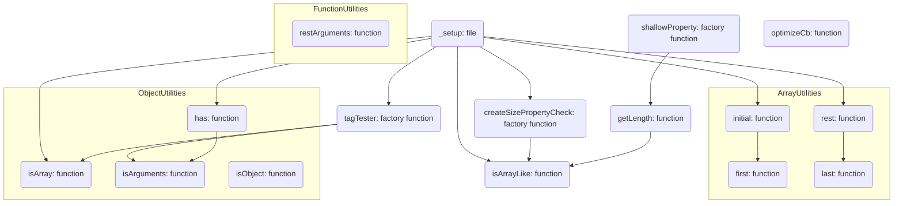

  

    
    <h1 align="center">To Realize Underscore</h1>
  

  

    ✨ A learning repository of Underscore source code
  

# 🗺️ Source Code Map

```mermaid
flowchart TD
  %% Define nodes and their names

  %%% `_xxx` files

  _setup(_setup: file)
  _shallowProperty(shallowProperty: factory function)
  _getLength(getLength: function)
  _createSizePropertyCheck(createSizePropertyCheck: factory function)
  _isArrayLike(isArrayLike: function)
  _tagTester(tagTester: factory function)
  _optimizeCb(optimizeCb: function)

  %%% Array functions

  subgraph ArrayUtilities
    initial(initial: function)
    first(first: function)
    rest(rest: function)
    last(last: function)
  end

  %%% Object functions

  subgraph ObjectUtilities
    isArray(isArray: function)
    isArguments(isArguments: function)
    isObject(isObject: function)
    has(has: function)
  end

  subgraph FunctionUtilities
    restArguments(restArguments: function)
  end

  %% Edge settings

  _setup --> initial
  _setup --> rest
  _setup --> _isArrayLike
  _setup --> _tagTester
  _setup --> isArray
  _setup --> has
  _setup --> _createSizePropertyCheck

  _tagTester --> isArray
  _tagTester --> isArguments
  _shallowProperty --> _getLength
  _createSizePropertyCheck --> _isArrayLike
  _getLength --> _isArrayLike
  initial --> first
  rest --> last 
  has --> isArguments

  %% Hyperlink settings

  %%% `_xxx` files
 
  click _setup "https://github.com/AshGreyG/To-Realize-Underscore/blob/main/modules/_setup.js"
  click _shallowProperty "https://github.com/AshGreyG/To-Realize-Underscore/blob/main/modules/_shallowProperty.js"
  click _getLength "https://github.com/AshGreyG/To-Realize-Underscore/blob/main/modules/_getLength.js"
  click _createSizePropertyCheck "https://github.com/AshGreyG/To-Realize-Underscore/blob/main/modules/_createSizePropertyCheck.js"
  click _isArrayLike "https://github.com/AshGreyG/To-Realize-Underscore/blob/main/modules/_isArrayLike.js"
  click _tagTester "https://github.com/AshGreyG/To-Realize-Underscore/blob/main/modules/_tagTester.js"
  click _optimizeCb "https://github.com/AshGreyG/To-Realize-Underscore/blob/main/modules/_optimizeCb.js"

  %%% Array functions

  click initial "https://github.com/AshGreyG/To-Realize-Underscore/blob/main/modules/initial.js"
  click first "https://github.com/AshGreyG/To-Realize-Underscore/blob/main/modules/first.js"
  click rest "https://github.com/AshGreyG/To-Realize-Underscore/blob/main/modules/rest.js"
  click last "https://github.com/AshGreyG/To-Realize-Underscore/blob/main/modules/last.js"

  %%% Object functions

  click isArray "https://github.com/AshGreyG/To-Realize-Underscore/blob/main/modules/isArray.js"
  click isArguments "https://github.com/AshGreyG/To-Realize-Underscore/blob/main/modules/isArguments.js"
  click isObject "https://github.com/AshGreyG/To-Realize-Underscore/blob/main/modules/isObject.js"
  click has "https://github.com/AshGreyG/To-Realize-Underscore/blob/main/modules/_has.js"

  %%% Function functions 😄

  click restArguments "https://github.com/AshGreyG/To-Realize-Underscore/blob/main/modules/restArguments.js"

```
